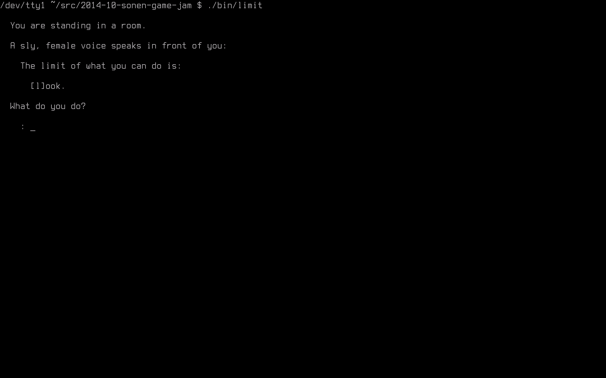

LIMIT
=====

[Sonen Game Jam](http://sonengamejam.org/), October 2014

Team Erik (of which I am the only member)

We were given 48 hours (actually 49 hours because of Daylight Savings Time).

This game is not very playable in its current state.

Screenshot
----------

Updates
-------

Note that being a game jam entry, no further commits will be pushed to this repository after the deadline. If you wish to see it further developed, look for a fork (like the one I'll be making after the game jam; [erikano/alive](https://github.com/erikano/alive)) or create a fork of it yourself.

Dependencies
------------

* **libSDL2**, assumed to be installed with prefix `/usr/local` (since that is where it was put by the script https://github.com/Keyaku/SDL2_RasPi_Install which I used to install it on my Raspbian-running Raspberry Pi). If that is not where it is located on your machine, modify the `Makefile` of this here game accordingly.

Compiling
---------

`make`

Running
-------

For the ultimate experience on your Raspbian-running Raspberry Pi, first disable X, then, as root (e.g. using `sudo`) run `dpkg-reconfigure console-setup`, picking font `terminus` and, probably, depending on your monitor, the largest font-size possible. You might need to reboot.

`./bin/limit`
